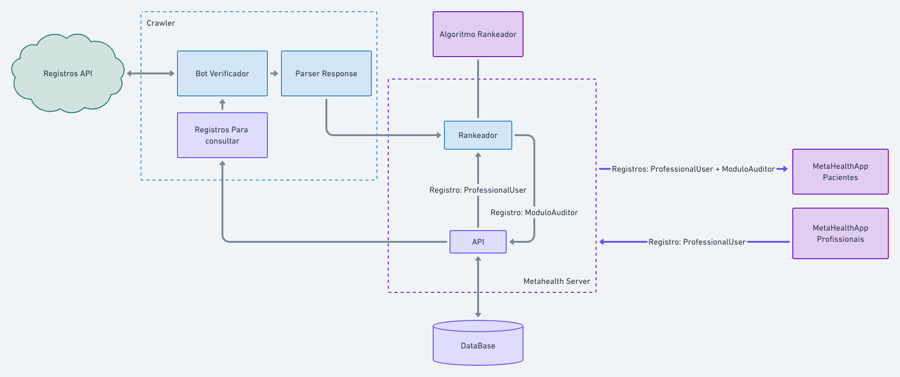
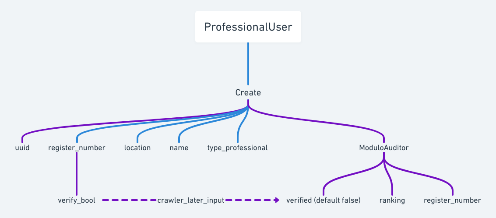

# Metahealth
Mental health auditor opensource project
- [Repositório do Server](https://github.com/vitorqueijo/metahealth_server)

# Objetivo
- Trazer um serviço gratuito e complementar a pacientes neurodiversos visando um melhor direcionamento e guia nos sistemas público e privados.
- Prezar pela privacidade e transparência do sistema para a sociedade
- Seguir os princípios democráticos de liberdade, autonomia e autarquia horizontal
- CopyLeft deve ser respeitado como máxima.

# Política do Projeto
- Sugestões são bem-vindas tais como Pull requests
- Toda contribuição será considerada à partir dessa data (26/03/2021)

# Work in progress
- O projeto está atualmente projetado para funcionar com uma api em Phoenix Elixir integrado com um DataBase relacional

- Os registros de Usuário Profissional e Modulo Auditor são correlacionados pelos uuids. O modulo auditor é o que permite a visualização e funcionamento dos app's (ainda em fase inicial).

## Copyleft for people
Todo o código aqui existe pela sociedade e não às custas dela
